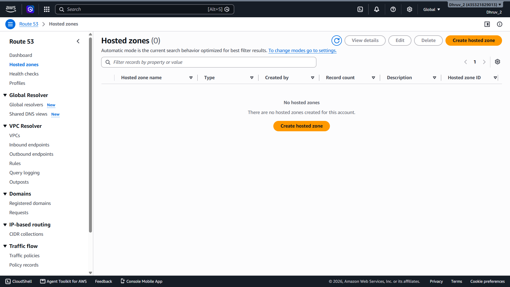
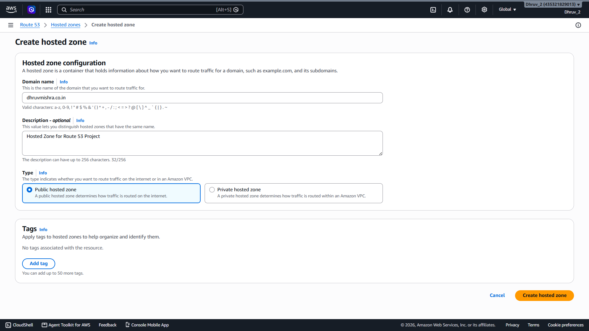
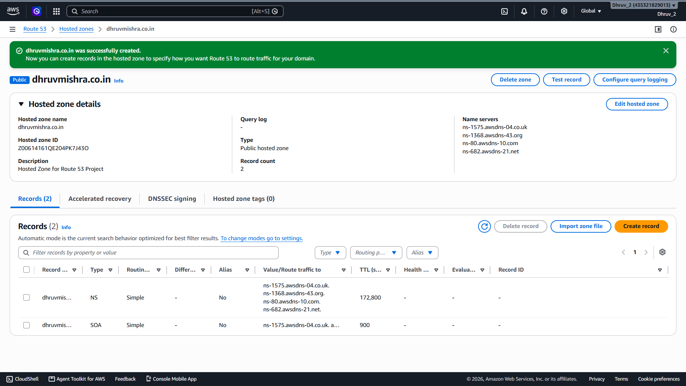

# 🌐 Create Public Hosted Zone

---

# 📖 Overview

In this milestone, a Public Hosted Zone was created in Amazon Route 53 for the existing custom domain **dhruvmishra.co.in**.

A Hosted Zone acts as a container for DNS records and enables Amazon Route 53 to manage DNS queries for the domain. During the creation process, Route 53 automatically generated the required NS (Name Server) and SOA (Start of Authority) records.

---

# 🎯 Objective

The objective of this milestone was to:

- Create a Public Hosted Zone in Amazon Route 53
- Associate the existing custom domain with Route 53
- Generate the default DNS records required for domain resolution
- Prepare the domain for DNS routing to AWS resources

---

# ⚙️ Hosted Zone Configuration

| Property | Value |
|----------|-------|
| Domain Name | dhruvmishra.co.in |
| Hosted Zone Type | Public Hosted Zone |
| Description | Hosted Zone for Route 53 Project |
| DNS Records Created | NS, SOA |

---

# 🏗️ Implementation Steps

## Step 1

Opened the **Amazon Route 53 Console** and navigated to the **Hosted Zones** section.

---

## Step 2

Clicked **Create Hosted Zone** to begin the configuration.

---

## Step 3

Configured the Hosted Zone.

- Domain Name: **dhruvmishra.co.in**
- Type: **Public Hosted Zone**
- Description: **Hosted Zone for Route 53 Project**

---

## Step 4

Reviewed the configuration and created the Hosted Zone.

Amazon Route 53 automatically generated the required DNS records for the domain.

---

## Step 5

Verified the automatically created DNS records.

- NS (Name Server) Record
- SOA (Start of Authority) Record

These records are required for DNS resolution and Hosted Zone management.

---

# ✅ Result

The Public Hosted Zone was created successfully for **dhruvmishra.co.in**.

The domain is now ready to be managed by Amazon Route 53. In the upcoming milestones, DNS records will be created to route traffic to Amazon S3 Static Website Hosting and Amazon EC2.

---

# 📷 Screenshots

### Hosted Zones Page

---

### Hosted Zone Configuration

---

### Hosted Zone Created Successfully

---

# 🚀 Next Step

The next milestone is to update the domain's nameservers with the Amazon Route 53 Name Servers.

This includes:

- Copying the Route 53 Name Servers
- Updating the nameservers in Hostinger
- Delegating DNS management to Amazon Route 53
