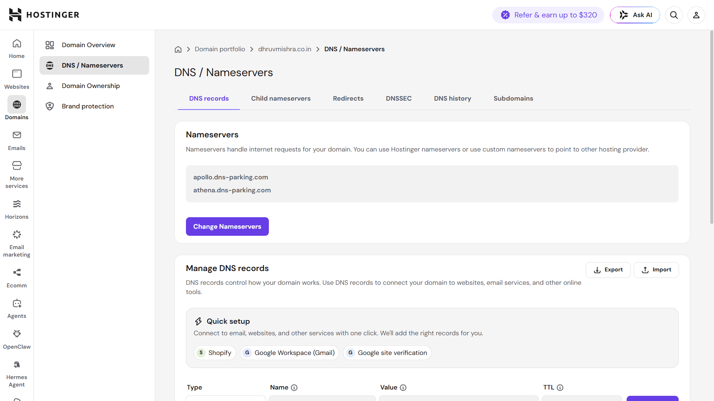
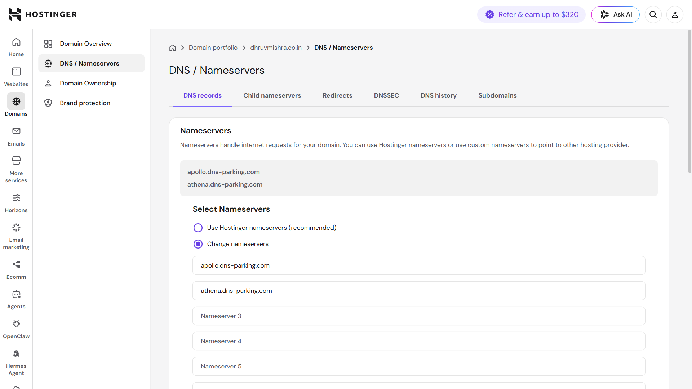
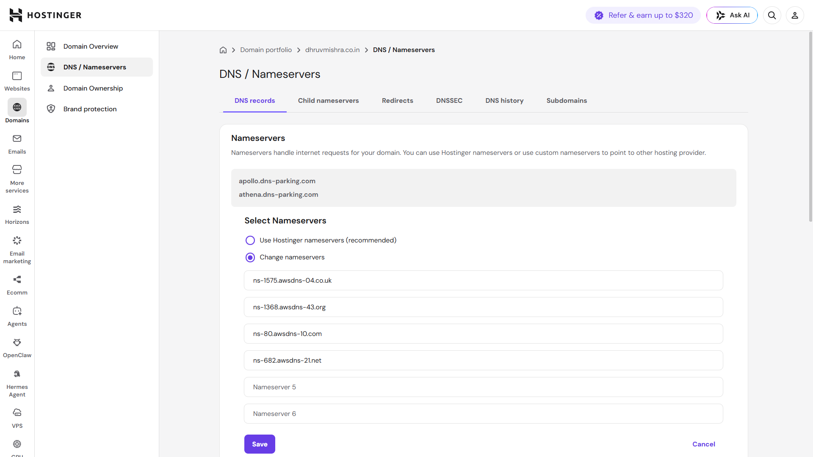
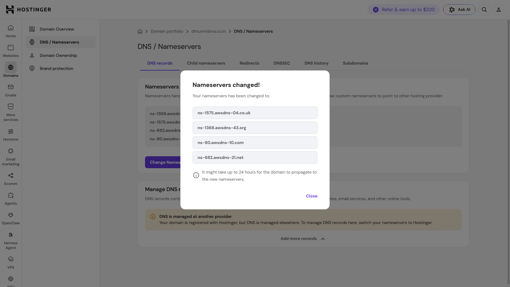
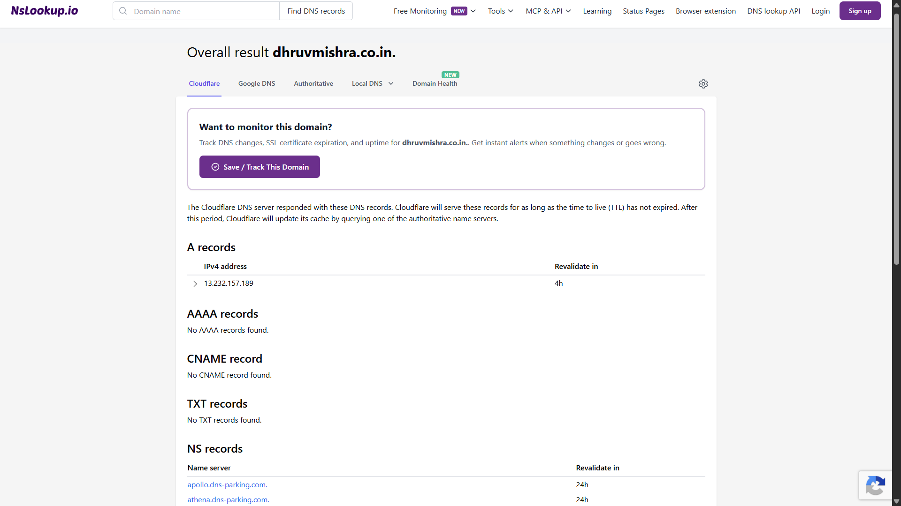
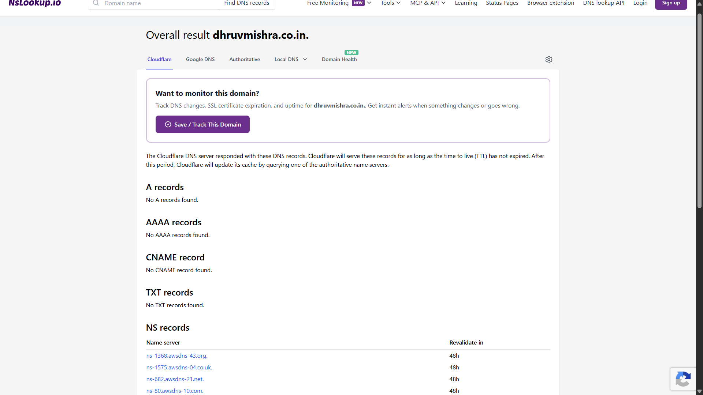

# 🌐 Delegate DNS Management to Amazon Route 53

## Overview

After creating a Public Hosted Zone in Amazon Route 53, the next step was to delegate DNS management from the domain registrar (Hostinger) to Route 53. This was accomplished by replacing the default Hostinger nameservers with the authoritative nameservers generated by Route 53.

Once DNS propagation completed, Amazon Route 53 became the authoritative DNS provider for the domain, allowing all future DNS records to be managed directly from AWS.

---

## Objective

- Delegate DNS management from Hostinger to Amazon Route 53.
- Replace the default Hostinger nameservers with the Route 53 nameservers.
- Verify successful DNS propagation.
- Prepare the domain for routing traffic to AWS resources in the following milestones.

---

## Services Used

- Amazon Route 53
- Hostinger Domain Management
- NSLookup.io (DNS Verification)

---

## Implementation Steps

### Step 1 – Open the Hosted Zone

1. Sign in to the AWS Management Console.
2. Navigate to **Amazon Route 53**.
3. Open **Hosted Zones**.
4. Select the hosted zone for **dhruvmishra.co.in**.
5. Locate the automatically created **NS record**.
6. Copy the four Route 53 nameservers.

---

### Step 2 – Update Nameservers in Hostinger

1. Log in to the Hostinger Dashboard.
2. Open **Domains**.
3. Select **dhruvmishra.co.in**.
4. Navigate to **DNS / Nameservers**.
5. Choose **Change nameservers**.
6. Replace the default Hostinger nameservers with the four Route 53 nameservers.
7. Save the changes.

---

### Step 3 – Wait for DNS Propagation

After saving the new nameservers, DNS propagation began.

During this period:

- Some DNS resolvers continued using the previous Hostinger nameservers.
- Other DNS resolvers gradually updated to the new Route 53 nameservers.
- Once propagation completed, Route 53 became the authoritative DNS provider for the domain.

---

### Step 4 – Verify DNS Delegation

DNS delegation was verified using **NSLookup.io**.

The verification confirmed that the domain was now using the following Amazon Route 53 nameservers:

- ns-1575.awsdns-04.co.uk
- ns-1368.awsdns-43.org
- ns-80.awsdns-10.com
- ns-682.awsdns-21.net

This confirmed that DNS management had successfully migrated from Hostinger to Amazon Route 53.

---

## Result

Successfully delegated DNS management from Hostinger to Amazon Route 53.

The domain is now managed by Route 53 and is ready for creating DNS records such as Alias, A, CNAME, MX, and TXT records in future milestones.

---

## Screenshots

### Default Hostinger Nameservers

---

### Open Change Nameservers Form

---

### Enter Route 53 Nameservers

---

### Nameservers Updated Successfully

---

### Route 53 Nameservers Active

---

### DNS Delegation Verified

---

## Key Outcome

- Created a complete DNS delegation between Hostinger and Amazon Route 53.
- Amazon Route 53 is now the authoritative DNS provider for the domain.
- Successfully verified DNS propagation after updating nameservers.
- Prepared the domain for routing traffic to AWS resources in the next milestone.

---

## Next Step

In the next milestone, an **Alias Record** will be created in Amazon Route 53 to route the custom domain (**dhruvmishra.co.in**) to the Amazon S3 Static Website Hosting endpoint, making the website accessible using the custom domain.
